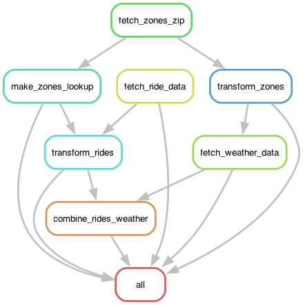
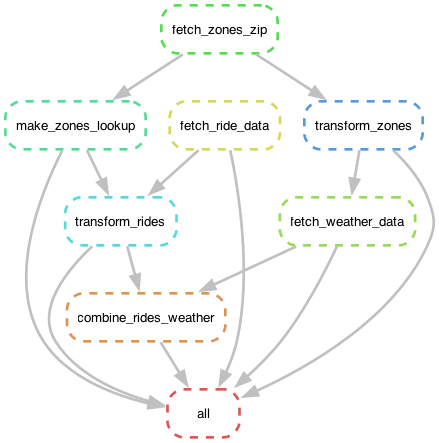

# NYC FHVHV–Weather Integration Pipeline

## Overview

This project builds a reproducible workflow to integrate 2023 NYC for-hire vehicle (FHVHV) trip data with Open-Meteo hourly weather data.
The pipeline uses Snakemake for workflow management and Polars for scalable data transformation.
Outputs include borough-hour–level ride aggregates joined with hourly weather variables.

## Workflow
Step | Snakemake Rule | Script | Description | Primary Data Artifact(s)
--- | --- | --- | --- | ---
1 | `fetch_zones_zip` | `fetch_zones_zip.py` | Downloads taxi zone zip file | `data/in/zones/taxi_zones.zip`
2 | `make_zones_lookup` | `make_zones_lookup.py` | Maps taxi zone `LocationIDs` to boroughs. | `data/tmp/zones_lookup.csv`
3 | `transform_zones` | `compute_zone_coordinates.py` | Extracts NYC borough coordinates | `data/tmp/borough_coordinates.csv`
4 | `fetch_ride_data` | `fetch_ride_data.py` | Downloads monthly 2023 FHVHV Parquet files | `data/in/rides/*.parquet`
5 | `transform_rides` | `transform_rides_data.py` | Cleans and aggregates rides by borough and hour | `data/tmp/rides_transformed.parquet`
6 | `fetch_weather_data` | `fetch_weather_data.py` | Retrieves hourly weather for each borough | `data/in/hourly_weather_2023.parquet`
7 | `combine_rides_weather` | `combine_rides_weather.py` | Joins aggregated rides with hourly weather | `data/out/citywide_hourly_2023.csv`

## Workflow Visualization

Snakemake can generate two useful workflow graphs.  
Both require **Graphviz** (`dot`) to be installed.

### Rule Graph
Shows how rules depend on each other (no file- or wildcard-level detail):

```bash
snakemake --rulegraph | dot -Tpng > provenance/rules.png
```



### Workflow DAG
Shows the fully expanded job-level DAG for the current run:

```bash
snakemake --rulegraph | dot -Tpng > provenance/dag.png
```


After running these commands, the images `rules.png` and `dag.png` will be created in the `/provenance` directory.

## Project Structure
```
CS598_Final_Project_ChristinePark/
├── Snakefile
├── config.yaml
├── pyproject.toml
├── scripts/
│   ├── fetch_ride_data.py
│   ├── compute_zone_coordinates.py
│   ├── make_zones_lookup.py
│   ├── transform_rides_data.py
│   ├── fetch_weather_data.py
│   └── combine_rides_weather.py
├── data/           # Not included in repo due to size limits
│   ├── in/         # Raw inputs (downloaded data)
│   ├── tmp/        # Intermediate transformations
│   └── out/        # Final outputs
└── README.md

```

⚠️ **Important Note:**
The `data/` directory is not included in this repository because the generated files are too large for GitHub. All input, intermediate, and final data outputs are stored in **[Box](https://uofi.box.com/s/2oommk4mla932lrpy89h6rmts1k06zq3)** for validation and comparison. When you run the pipeline locally, these files will be automatically generated in the `data/` directory.


## Running the Pipline with Docker Compose
This project provides a prebuilt Docker image on Docker Hub to ensure reproducibility and provenance across all environments. The included `docker-compose.yaml` runs the workflow using this published image and mounts a host data directory into the container so that all inputs, intermediates, and outputs persist on your machine.

The data directory can be customized at runtime using an environment variable.

### Data Directory Selection (Dynamic)
The Compose configuration uses:
```yaml
volumns:
    - ${DATA_DIR:-./data}:/app/data
```

This means:
* If `DATA_DIR` is set -> that path is used
* If not set -> the default `./data` is used

#### Example: Use the default ./data directory
```bash
docker compose run pipeline
```

Outputs will appear under:
```bash
./data/
```

#### Example: Use a custom data directory
Relative path (recommended)
```bash
DATA_DIR=./custom_directory docker compose run pipeline
```
Absolute paths (supported if Docker has access)
```bash
DATA_DIR=/valid/absolute/directory docker compose run pipeline
```

Because the image is published to Docker Hub, you do not need to build it locally.

### Running the complete workflow
```bash
docker compose run pipeline
```
This executes the full Snakemake workflow using the published Docker image.

### Running a Specific Rule
Snakemake requires a core count (-c N) for any local execution, including single-rule runs.

Correct usage:
```bash
docker compose run pipeline -c 1 transform_rides
```

## Container Image Provenance
This workflow is executed using a published Docker image to ensure environment consistency and reproducibility.

Docker Image:
```
cp60uiuc/nyc-fhvhv-weather-integration-pipeline:v1
```

Image Digest:
```
sha256:f75d871c95acbe573f3e2b24d60c39bc4e08d446568c8457c076a30f1ddb042b
```

The digest uniquely identifies the exact image used to run the workflow.
The `docker-compose.yaml` configuration references this published image so all users run the pipeline in the same environment.


## (Optional) Local Development Environment

The project uses [uv](https://docs.astral.sh/uv/) for Python environment management.

1. Install `uv` if not already installed:

```bash
pip install uv
```

2. Create a virtual environment using `uv` (defaults to .venv):
```bash
uv venv
```

3. Activate the environment:
```bash
source .venv/bin/activate
```

4. Install dependencies:
```bash
uv sync
```
This installs all dependencies from pyproject.toml into .venv.

### Key Packages
* Python ≥ 3.12
* Snakemake ≥ 8
* Polars
* Geopandas
* Open-Meteo-Requests


## (Optional) Running the Pipeline Locally

Run the complete workflow:

```bash
snakemake -c 4
```

Or execute a specific step, for example:

```bash
snakemake -c 2 transform_rides
```

## Configuration

All paths and URLs are defined in config.yaml